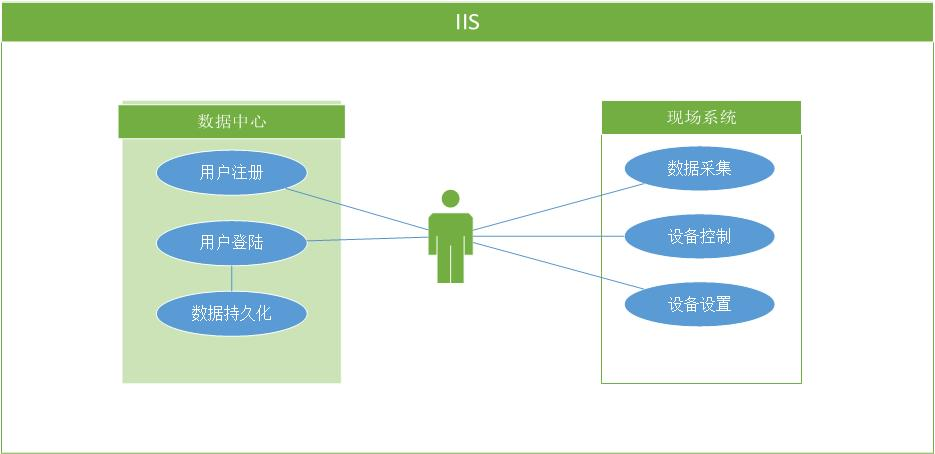
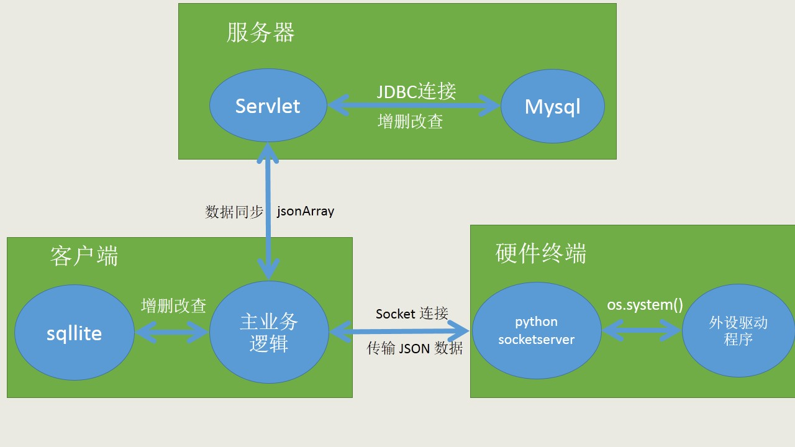
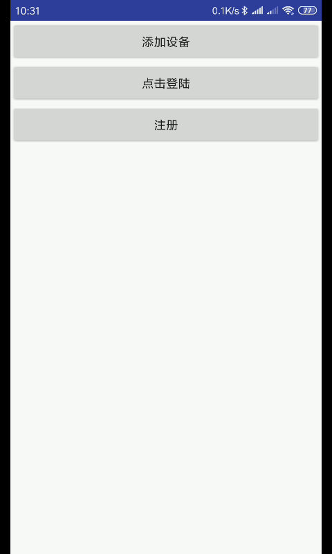
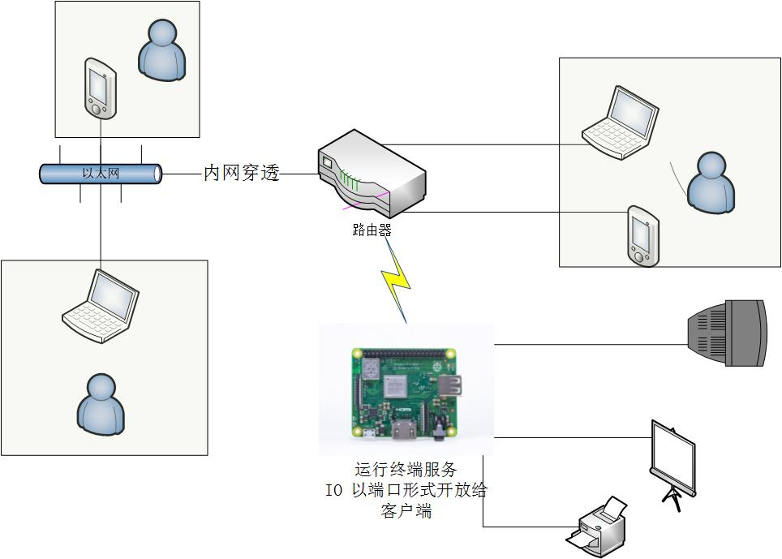

### IIS
IIS（Intelligent Infrasture System）是一套 IoT 系统，包含运行在 Andorid 平台上的客户端（client），运行在 raspberry 上的服务端（server）以及数据中心（center）。实现数据采集，设备控制等功能。








### Installation
##### Client
[下载](https://github.com/LuuMing/IIS/blob/master/client/build/app-release.apk?raw=true)并安装
##### Server
`git clone https://github.com/LuuMing/IIS.git` 克隆项目

`cd IIS/server` 进入 server 文件夹

`python3 server.py` 运行 server

### Usage Guide
#### 测试安装

#### 控制小灯泡

#### 控制风扇速度

#### 采集温度

### Configuration
增加/删除功能，请编辑运行在服务端上的配置文件`config.ini`，格式如下：
```
[module name]  模块名称
type = [action | setter | status]  模块类型=[动作|设置|采集]
cmd = [module command]    执行模块功能的命令
```
### Data Center
1\. 使用数据中心，请配置 AndoridStudio 3.0+ 开发环境，导入 client 文件夹下的项目。
编辑 `Andorid/app/src/main/java/com/example/luming/iis/WebService.java/com/example/luming/iis/WebService.java`
```
private static String IP = "192.168.43.111:8080"; //修改为你的服务器 IP 地址
```
修改完成，重新编译安卓项目并安装。

2\. 数据中心服务器，进入 center 文件夹，初始化数据库，进入 mysql 并执行命令：
```
mysql > source init_db.sql
```
3\. 使用 eclipse EE 导入 center 项目，配置并运行 tomcat 即可。